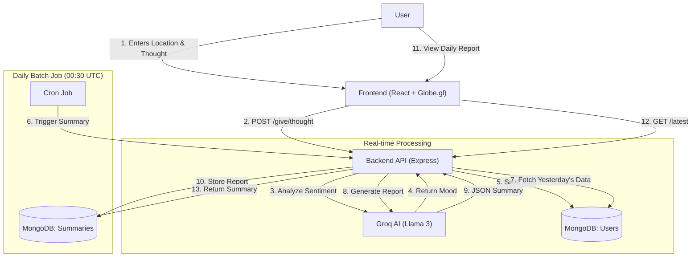

# YourPlanet 🌍

> **"Every morning, discover what the world felt yesterday."**

A live interactive globe mapping the collective consciousness of humanity. Users share their 25-character thoughts, AI analyzes the sentiment, and daily reports reveal the emotional pulse of the planet.


## 💡 The Vision

We don't just track individual stats; we track the **vibe of the world**.
What is the collective mood of India today? Is Europe feeling hopeful or anxious?
By aggregating thousands of micro-thoughts, we build a daily emotional map of Earth.

## 🚀 How It Works

### User Journey

1.  **Land on Earth** → You see a beautiful, living 3D globe.
2.  **Set Location** → Auto-detect or manually search for your city (e.g., "Mumbai", "London").
3.  **Share Your Vibe** → Type how you feel in **25 characters or less**.
    - _Example: "Finally got the job! 🎉"_
    - _Example: "Rainy days make me chill."_
4.  **AI Analysis** → Our backend instantly analyzes your text to detect the underlying mood (Happy, Sad, Excited, etc.).
5.  **Global Signal** → Your vibe lights up on the globe, joining thousands of others.

### ⏰ The Daily Cycle (00:30 UTC)

Everything leads up to the **Daily Drop**.

1.  **Data Collection**: Throughout the day, vibes accumulate from all varying timezones.
2.  **Midnight Reset**: The globe visualizes a fresh start.
3.  **AI Processing**: At 00:30 UTC, our AI Engine (Llama 3 via Groq) wakes up.
    - It reads every thought submitted in the last 24 hours.
    - It identifies patterns, dominant emotions, and regional anomalies.
4.  **Report Published**: The **Daily Mood Report** goes live.
    - "Yesterday, the world felt _Hopeful_."
    - "Happiest Country: Denmark 🇩🇰"
    - "Most Active Region: South Asia 🌏"

## 🏗️ Architecture



## 🛠️ Tech Stack

**Frontend**

- **React 19** (Vite): Fast, modern UI.
- **React Globe GL**: High-performance WebGL globe visualization.
- **Tailwind CSS**: Sleek, responsive design.

**Backend**

- **Node.js / Express**: Robust REST API.
- **Groq SDK**: Ultra-fast AI inference for sentiment analysis and summarization.

**Database**

- **MongoDB**: Flexible schema for storing high-volume user thoughts and complex daily summary objects.

## 🏃‍♂️ Getting Started

### Prerequisites

- Node.js (v18+)
- MongoDB Connection String
- Groq API Key

### Installation

1.  **Clone the repository**

    ```bash
    git clone https://github.com/SanketBhandarii/YourPlanet.git
    cd YourPlanet
    ```

2.  **Setup Backend**

    ```bash
    cd backend
    npm install
    # Create .env file with:
    # MONGO_URI=...
    # GROQ_API_KEY=...
    # PORT=8000
    npm run dev
    ```

3.  **Setup Frontend**
    ```bash
    cd frontend
    npm install
    # Create .env file with:
    # VITE_BACKEND_URL=http://localhost:8000
    npm run dev
    ```

---

_Built to connect humanity, one vibe at a time._
